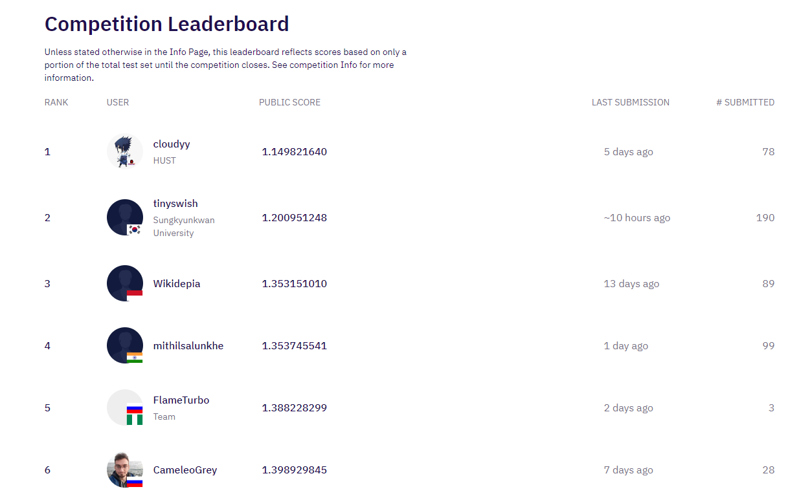

# About

My developments for Wadhwani AI Bollworm Counting Challenge (https://zindi.africa/competitions/wadhwani-ai-bollworm-counting-challenge).
I stopped working on this competition. So, everyone can use my src and try to reach the top self. Probably my code will be useful.

Put raw competition data into bollworm_counting_challenge/data/. 
All other directories will be created automatically.

Good luck!

# Results



# Installation

```
git clone https://github.com/CameleoGrey/bollworm_counting_challenge.git
conda create -n bollworm_counting_challenge python=3.10
conda activate bollworm_counting_challenge
pip3 install torch==1.13.0+cu117 torchvision==0.14.0+cu117 torchaudio===0.13.0+cu117 -f https://download.pytorch.org/whl/cu117/torch_stable.html
pip install -r requirements.txt
```